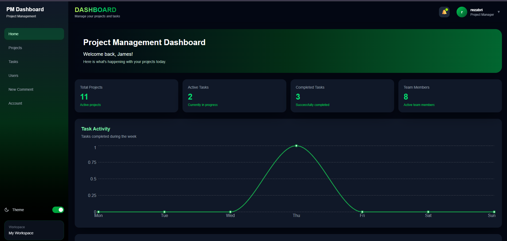

# Management Dashboard

A responsive project management dashboard built with **React, TypeScript, Redux Toolkit, and JSON Server**.

This project was created as a portfolio project to practice building a real-world frontend application with CRUD operations, API integration, state management, authentication flow, responsive UI, dark mode, and reusable components.

## 🚀 Live Demo

**Frontend:**  
https://managment-dashboard-projects.vercel.app

**Backend API:**  
https://managment-dashboard-projects.onrender.com

> The backend is powered by JSON Server and is deployed separately on Render.

---

## 📸 Preview

---

## ✨ Features

- 🔐 Login and session management
- 📊 Dashboard with statistics and charts
- 📁 Project management
  - Create projects
  - Edit projects
  - Delete projects
  - View project details
  - Add and remove project members
- ✅ Task management
- 👥 Team member management
- 💬 Comment management
- 🔔 Notifications
- 🔎 Global search
- 🔍 Filtering and pagination
- 👤 User profile management
- 🖼️ Profile avatar management
- ⚙️ Account and appearance settings
- 🌙 Dark / Light mode
- 📱 Fully responsive design
- ✅ Form validation
- ⏳ Loading states
- ⚠️ Error states
- 📭 Empty states
- 🔔 Toast notifications
- ⚡ REST API integration
- 🗃️ Global state management with Redux Toolkit

---

## 🛠️ Technologies

### Frontend

- React
- TypeScript
- Vite
- React Router
- Redux Toolkit
- React Redux
- Axios
- React Hook Form
- Zod
- Tailwind CSS
- Recharts
- React Icons
- Sonner
- SweetAlert2

### Backend

- JSON Server
- REST API

### Deployment

- Vercel — Frontend
- Render — Backend

---

## 📂 Project Structure

    src/
    ├── components/
    │   ├── comments/
    │   ├── layout/
    │   ├── projects/
    │   ├── tasks/
    │   └── users/
    │
    ├── features/
    │   ├── auth/
    │   ├── comments/
    │   ├── notifications/
    │   ├── projects/
    │   ├── tasks/
    │   └── users/
    │
    ├── hooks/
    │
    ├── pages/
    │   ├── Home/
    │   ├── Projects/
    │   ├── ProjectDetails/
    │   ├── Tasks/
    │   ├── Users/
    │   ├── Profile/
    │   └── Login/
    │
    ├── services/
    ├── store/
    ├── types/
    │
    ├── App.tsx
    └── main.tsx

---

## 🔑 Demo Login

    Email: rezabri806@gmail.com
    Password: 123456

---

## ⚙️ Installation

Clone the repository:

    git clone <YOUR_GITHUB_REPOSITORY_URL>

Navigate to the project:

    cd "Managment Dashboard"

Install dependencies:

    npm install

---

## 🔧 Environment Variables

Create a `.env` file in the project root:

    VITE_API_URL=http://localhost:3000

For production, the API URL points to the deployed Render backend.

---

## 🗄️ Run the Backend

Start JSON Server:

    npx json-server db.json

The API will be available at:

    http://localhost:3000

---

## 💻 Run the Frontend

Start the development server:

    npm run dev

Then open the local URL provided by Vite.

---

## 🏗️ Production Build

Build the project:

    npm run build

Preview the production build:

    npm run preview

---

## 🔄 API

The application communicates with a REST API using Axios.

Main resources:

    /projects
    /tasks
    /users
    /notifications
    /comments

The API base URL is controlled through the `VITE_API_URL` environment variable.

---

## 🎨 UI & UX

The dashboard was designed with a focus on:

- Responsive layouts
- Mobile-friendly navigation
- Dark and light themes
- Consistent green visual identity
- Reusable UI components
- Clear loading and error states
- User-friendly confirmations
- Accessible interactive elements

---

## 📚 What I Practiced

Through this project I practiced:

- Building scalable React applications
- TypeScript with React
- Redux Toolkit and global state management
- REST API integration
- CRUD operations
- Authentication and session handling
- Form handling and validation
- React Router
- Custom Hooks
- Component-based architecture
- Responsive UI development
- Dark mode implementation
- API error handling
- Pagination and filtering
- Deployment with Vercel and Render

---

## 🚀 Deployment

The frontend is deployed on **Vercel** and the JSON Server backend is deployed on **Render**.

The frontend is connected to the GitHub repository, so new changes pushed to the repository are automatically deployed to Vercel.

---

## 📌 Future Improvements

Possible future improvements include:

- More advanced authentication
- Role-based permissions
- Real-time notifications
- Advanced project analytics
- Better API/database solution
- More advanced task management
- Improved performance and code splitting

---

## 👨‍💻 Author

**Reza Bamoniri**

Frontend Developer focused on building modern, responsive, and maintainable web applications with React and TypeScript.